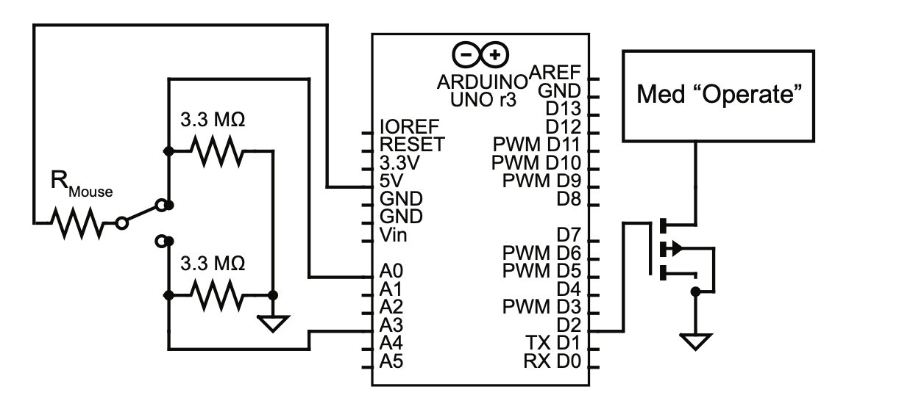

# FNC Lickometer
An Arduino-based device for doing Flavor-Nutrient conditioning in a mouse's home cage. This repository contains code to 1) read analog pins on the Arduino to detect and count licks, 2) trigger an infusion in response to licking, and 3) timestamp lick events for post-hoc analyses. Below is the circuit diagram for the device itself: 

In practice, the 5V pin is connected via an aligator clip to wire flooring placed on the bottom of a clean mouse cage. The spouts themselves are then connected back to ground via the pictured 3.3MOhm pull down resistor. 

"Med Operate" refers to the operate pin of the Med Associates variable speed syringe pumps (PHM-210) which the device was designed around. The other pins on the syringe pump should be connected to a 28V power supply (see the [manual](https://med-associates.com/wp-content/uploads/2022/09/DOC-330-R1.0-PHM-210-Variable-Speed-Syringe-Pump.pdf) for the pinout). *Note: the ground of the power supply must be connected to the ground of the Arduino for this to work.*

## Installation
The use of this device requires a working installation of the Arduino IDE and Python3. The only non-base Python package required for the provided code to work is pandas, which may be installed either with pip or conda.

## Getting Started
After assembling the above circuit, before using this device the user needs to first set up a ports.txt file and set certain device specific parameters in the Arduino code.

The ports.txt code is meant to contain a list of usb ports where an Arduino may be plugged in. You can usually find a list of these port addresses in the Arduino IDE when the Arduinos are plugged in by looking under Tools>Port. The port addresses for different Arduinos should be specified on separate lines in ports.txt and in order of

Within the Arduino code itself, at the top a number of variables are defined, most of which need not be touched (Many of these are definitions of pin numbers). The main variable that users should be aware of is the variable thresh, which should specify a threshold change in voltage, above which we will register a lick. To get a sense for what value to set here, set the variable debug to be true and open the Serial plotter after flashing the code to the arduino. You can test out the lickometer by touching the wire floor of the cage and the spout simmultaneously. From this test one may determine a reasonable threshold for lick detection. 

## Operation
After setting these values, one may use the device to condition mice and collect data by first flashing code to each of the Arduinos to be used at the beginning of the experiment, and immediately aftterwards running the script `read_lickometers.py` from the command line while in the project directory. To see relevant arguments for this script run `python read_lickometers.py -h`